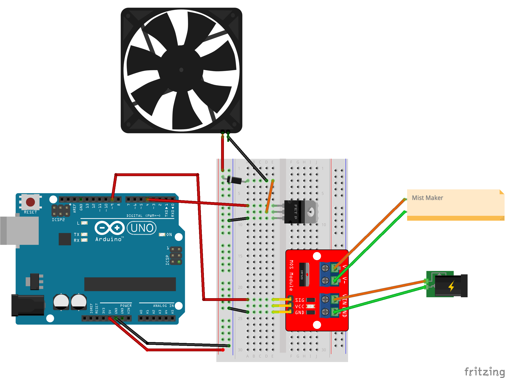

# Smell Prototype

# Documentation

## For this project you will need:

**Software:**
[Arduino IDE](https://www.arduino.cc/en/Main/Software), [Processing IDE](https://processing.org/download/), [Firefox Browser](https://www.mozilla.org/en-CA/firefox/new/), [NodeJS](https://nodejs.org/en/) 

**Hardware:**
 1 [N-Channel MOSFET](https://www.sparkfun.com/products/10213), 1 [IRF520 Driver](https://www.amazon.ca/gp/product/B07GBY5QYV/), 1 [Cooling Fan](https://www.amazon.ca/gp/product/B07SRRWHVN/), 1 [Mist Maker](https://www.amazon.ca/gp/product/B00P8V4KIO/), 1 Arduino Uno Rev 3 or equivalent, jumper wires, alligator clips, breadboard, mason jar (or any container), and a straw

## To set up the repository
Using the command line...
1. Navigate to the directory where you want to place the repository
1. `git clone https://github.com/choruslab/NoVizSmell.git`
1. `cd NoVizSmell/server`
1. `npm install`

## To set up the extension
1. Open your Firefox Browser
1. In the search bar type: `about:debugging`
1. On the left of the screen, click on the **_This Firefox_** button
1. Click on the **_Load temporary Add-on..._** button
    - This will pop-up your file system
1. Use the pop-up to navigate to the repository
1. Inside the repository, you will find a folder called **_extension_**
1. Pick the file called **_manifest.json_**
1. Click on the **_open_** button

## To set up the Arduino
1. [Follow the picture at the bottom to assemble the hardware](#arduino-circuit)
1. Open the Arduino IDE
1. Click on the **_File_** button at the top of the screen
1. Click on the **_Open..._** button
    - This will pop-up your file system
1. Use the pop-up to navigate to our repository
1. Inside the repository, you will find a folder called **_arduino_**
1. Pick the file called **_olfactoryPrototype.ino_**
1. Click on the **_open_** button
1. Install the **_VSync.h_** library
    - You can find instructions here: https://github.com/erniejunior/VSync
1. You can now connect the Arduino board to your computer using the USB cable
1. Go to **_Tools_->_Port_** and choose one to communicate to the board

## To set up Processing
1. Open the Processing IDE
1. Click on the **_File_** button at the top of the screen
1. Click on the **_Open..._** button
    - This will pop-up your file system
1. Use the pop-up to navigate to our repository
1. Inside the repository, you will find a folder called **_Processing_**
1. Pick the file called **_osc.pde_**
1. Click on the **_open_** button
1. Install the needed libraries by going to **_Sketch_->_Include Library..._->_Add Library..._**
    1. Use the filter to look for:
        - VSync
        - oscP5
    1. The install button is at the bottom-right of the screen
1. Make sure that the variable `port` (line 24) is set to the port being used for the Arduino 
    1. You can check the port in the Arduino IDE by going to **_Tools_->_Port_**

### Once you have set up everything mentioned above, you can run everything
1. Get the web app running:
    - Using the command line
        1. Navigate to our repository
        1. `cd NoVizSmell/server/`
        1. `npm start`
1. Make sure that your extension is set up
    - **Note:** Everytime you open the Firefox Browser, you will have to set up the extension again
1. Upload the Arduino sketch to the board
1. Run the Processing sketch

# Arduino Circuit
